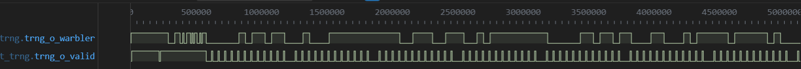
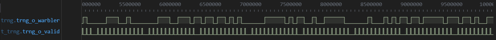
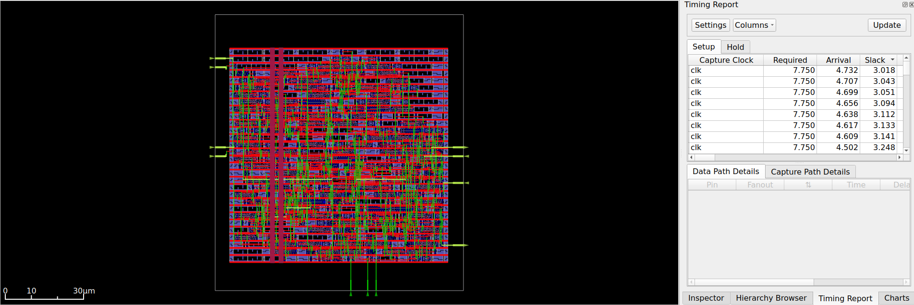
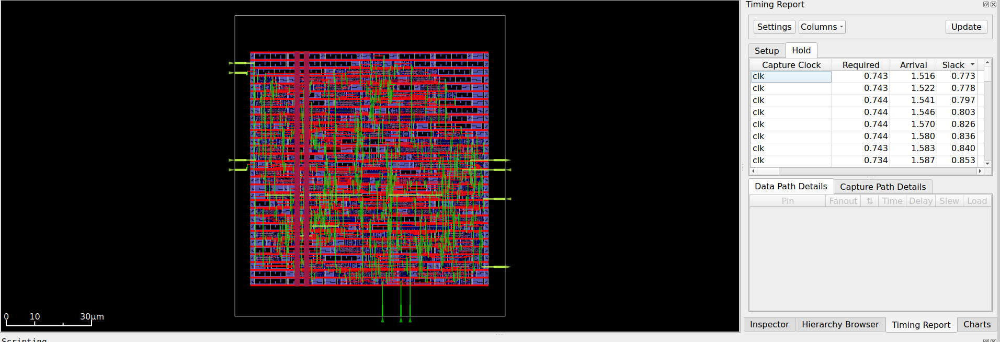
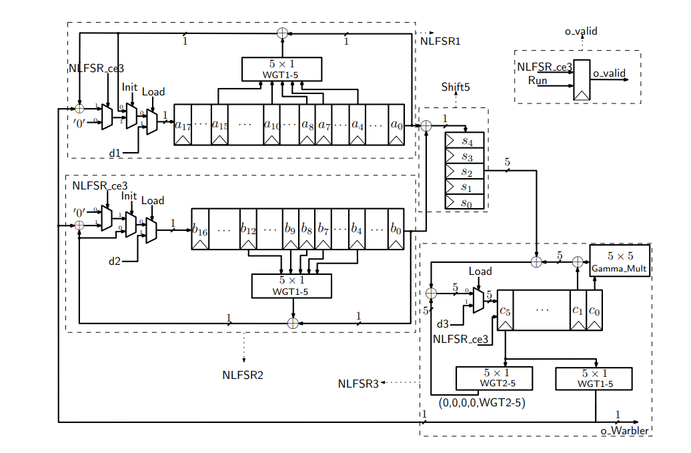
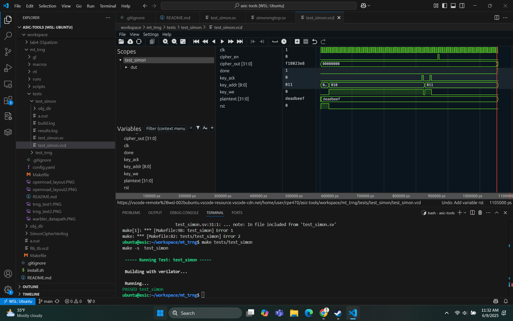
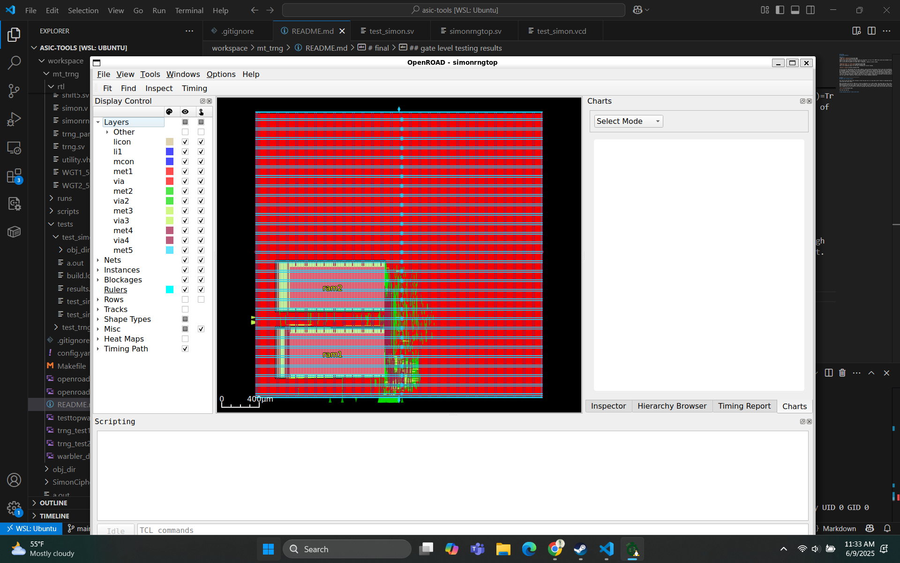

# mt_trng
## Waveform Results

### Test 1

Above are our test results. In order to test our rng device, we ran it for 1000 clock cycles and checked to see if the amount of times it was high was around the same times it was low.
Also, you can see no pattern (at least that I recognize), making it pretty random. 

This is our openroad layout for the chip, including our initial timings. 

A lot of our RTL code doesn’t have too many comments, mainly because many design choices stem from finite‐field mathematics (And my knowledge of it stems mainly from a 30 minute youtube video of it). Essentially, you have three shift registers characterized by different feedback polynomials interacting with WG-5 transformation modules (precomputed as lookup tables for efficiency). The most complicated part is the NLFSRs, which implement nonlinear recurrence relations over GF(2⁵) using multiple tap positions and trace functions. At each clock, selected register bits form a 5-bit vector that is fed through the WG-5 trace function WGT-5(xᵈ)=Tr((x+1)^k), yielding nonlinear feedback. This finite-field arithmetic combined with nonlinear filtering ensures a maximal period of 2ⁿ–1 and high linear complexity, giving Warbler its strong randomness properties.

__________________________________________
# final
## gate level testing results

One issue we had with gate level testing is that the wave file is so big that surfer refuses to download and play it, so unfortunatley we cant show the top level tests for that.

What we decided to do with our RNG ram is that we connected it to a simon cipher. The whole idea is that a key is randomly generated and stored for you, and you just use the address of the ram to run the cipher and get your cipher text from the plain text by waiting for the done signal. Kinda nice! You don't have to generate your own key and stuff! All you do is set key_we high and a random key will be written to the ram at key_addr when key_ack is raised, which can be then used to encrypt your plaintext. 

The test was done by Writting a random address to 10 and 11, and then using them for a 64 bit key starting at 10 to encode deadbeef. Output is f18023e8

Above is the openroad configuration with our two rams placed right above another. 

# Stay awesome and don't stay up too late
